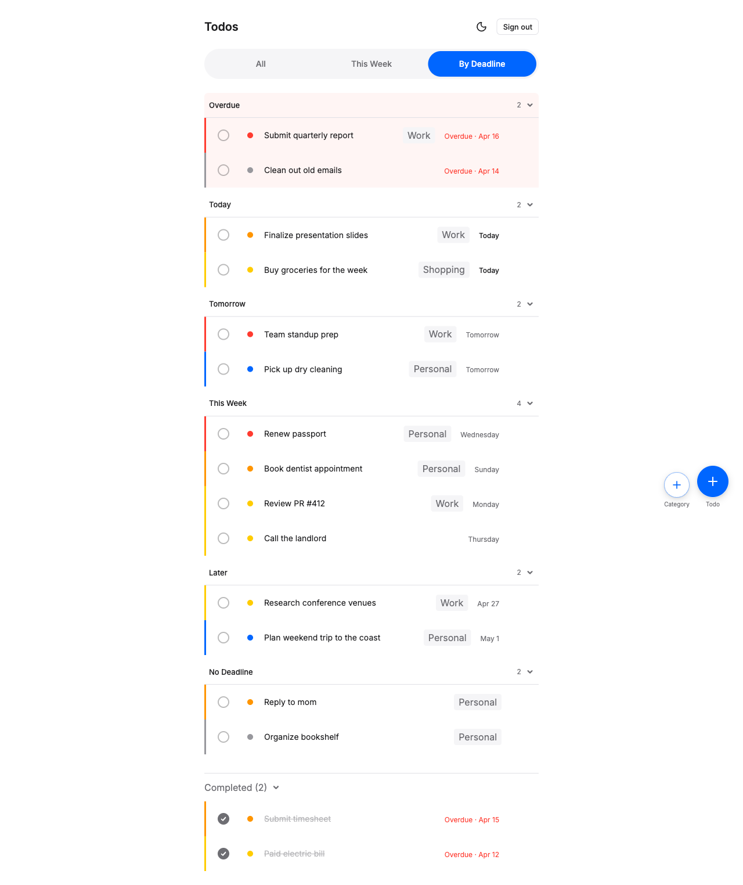
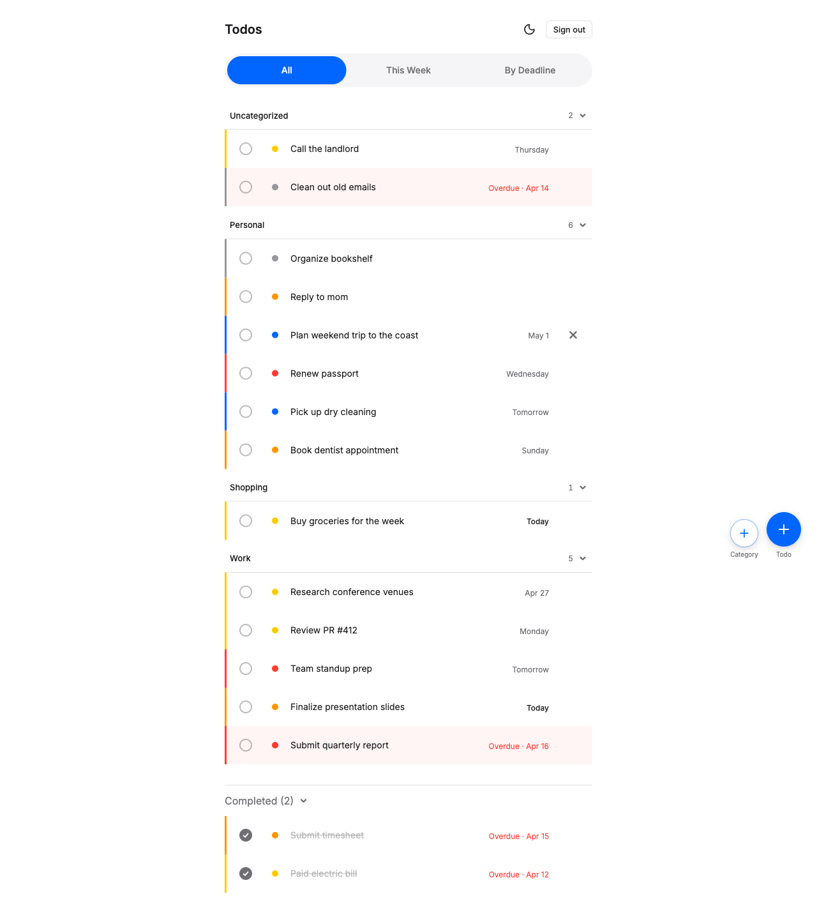
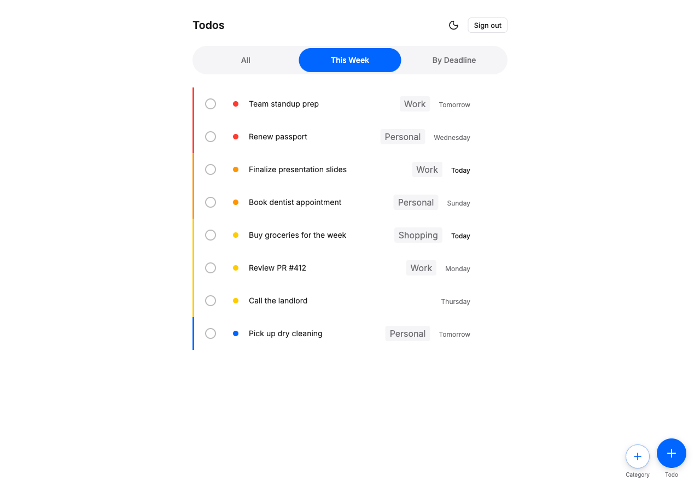

<p align="center">
  
</p>

<p align="center">
  
  
</p>

<p align="center"><em>A minimal, crafted Todo web app — single-user, full-stack, containerized. <a href="docs/overview.md">Feature walkthrough →</a></em></p>

---

# bmad_nf_todo_app

A minimal, crafted Todo web app — single-user, full-stack, containerized.

## Tech Stack

- **Frontend** — React 19, TypeScript, Vite 7, Tailwind CSS 4, shadcn/ui v4 components
- **Backend** — FastAPI ~0.135, SQLModel, Alembic, Python 3.12
- **Database** — PostgreSQL 16
- **Infrastructure** — Docker Compose v2

## Prerequisites

- **Docker Desktop** (or any compatible Docker daemon) with Compose v2
- **pnpm 10.x** — only required if you need to regenerate the frontend lockfile after editing `package.json`. Not needed to run the app.

No Python, Node, or Postgres installation required on the host — everything runs in containers.

## Quick Start

```sh
git clone <repo-url>
cd bmad_nf_todo_app
cp .env.example .env
make up         # or: docker compose up -d --build
```

Once all services are healthy:

- **Frontend** → http://localhost:5173
- **Backend API** → http://localhost:8000
- **Swagger UI** → http://localhost:8000/docs

Stop the stack: `make down`

## Environment Variables

All variables are defined in `.env.example`. Copy it to `.env` and override as needed.

| Variable | Purpose | Example |
|---|---|---|
| `DATABASE_URL` | Postgres connection string used by backend | `postgresql://todo:todo@db:5432/todo_app` |
| `JWT_SECRET` | HS256 signing key for auth tokens; use a strong random value (32+ chars) in production | `dev-secret-change-me-in-production` |
| `CORS_ORIGIN` | Allowed origin for browser requests | `http://localhost:5173` |
| `VITE_API_URL` | Backend URL consumed by frontend at build time | `http://localhost:8000` |
| `POSTGRES_USER` | Postgres container init user | `todo` |
| `POSTGRES_PASSWORD` | Postgres container init password | `todo` |
| `POSTGRES_DB` | Postgres container init database name | `todo_app` |

The hostname `db` in `DATABASE_URL` is the Docker Compose service name. Accessing Postgres from your host machine uses `localhost:5432`.

## Project Structure

```
bmad_nf_todo_app/
├── docker-compose.yml           # 3-service stack: db, backend, frontend
├── Makefile                     # Convenience targets (see `make help`)
├── .env.example                 # Template; copy to .env
├── frontend/                    # React + Vite + Tailwind + shadcn/ui
│   ├── Dockerfile
│   ├── package.json
│   └── src/
├── backend/                     # FastAPI + SQLModel + Alembic
│   ├── Dockerfile
│   ├── entrypoint.sh            # Runs `alembic upgrade head` then uvicorn
│   ├── requirements.txt
│   ├── app/
│   │   ├── main.py              # FastAPI app factory
│   │   ├── core/config.py       # Pydantic BaseSettings (env-driven)
│   │   ├── models/              # SQLModel definitions (populated in later stories)
│   │   └── routers/             # Route handlers (populated in later stories)
│   └── alembic/                 # Database migrations
├── _bmad-output/                # Planning artifacts (not deployed)
└── _bmad/                       # BMad tooling configuration (not deployed)
```

## Make Targets

Run `make help` (or just `make`) for the full list. Highlights:

| Target | Description |
|---|---|
| `make up` | Start the full stack (detached, auto-build) |
| `make up-logs` | Same as `up` but foreground with live logs |
| `make down` | Stop containers (preserves data volumes) |
| `make reset` | Stop AND wipe all data (destroys Postgres volume) |
| `make logs` | Tail logs from all services |
| `make logs-backend` / `make logs-frontend` / `make logs-db` | Tail specific service |
| `make ps` | Show service status |
| `make shell-backend` | Interactive `/bin/sh` in backend container |
| `make shell-db` | psql shell in db container |
| `make migrate` | Run Alembic `upgrade head` |
| `make migration name="<description>"` | Generate autogenerated migration |
| `make install-frontend` | Run `pnpm install` in `frontend/` (regenerates lockfile) |
| `make lint-frontend` | Run ESLint inside the frontend container |
| `make typecheck-frontend` | Run `tsc --noEmit` inside the frontend container |
| `make clean` | Wipe containers, volumes, and local images (destructive) |

## Development Workflow

**Hot reload** is enabled for both services when running via Docker Compose:

- Edits to `frontend/src/**` trigger Vite HMR; updates reflect in the browser within ~1 second.
- Edits to `backend/app/**` trigger Uvicorn reload; the API serves updated code within ~2 seconds.
- PostgreSQL data persists across `make down`/`make up` cycles via the named `postgres_data` volume.
- Services auto-restart on transient crashes (via `restart: unless-stopped`).
- The `frontend` service waits for `backend` to pass its healthcheck before starting.

**Database migrations:**

```sh
# After adding or changing a SQLModel in backend/app/models/:
make migration name="add users table"
# Review the generated file in backend/alembic/versions/, then:
make migrate
```

Migrations also run automatically on backend container startup via `entrypoint.sh`.

> `make migrate` and `make migration` use `docker compose exec` — the stack must be running (`make up`) before invoking them.

## Troubleshooting

- **`docker compose up` fails with "Cannot connect to Docker daemon":** Start Docker Desktop and retry. On macOS, Docker Desktop can occasionally disconnect — a full restart of the app resolves it.
- **`pnpm install --frozen-lockfile` fails in the frontend build:** `package.json` was edited without regenerating the lockfile. Run `make install-frontend` and then retry `make up`.
- **Backend exits immediately on startup with `ValidationError`:** One of `DATABASE_URL`, `JWT_SECRET`, or `CORS_ORIGIN` is missing or empty in `.env`. Copy `.env.example` and ensure all values are set.
- **Migrations fail with a database connection error:** Verify `POSTGRES_USER` / `POSTGRES_PASSWORD` in `.env` match the credentials encoded in `DATABASE_URL`.

## License

Portfolio project — license TBD.
