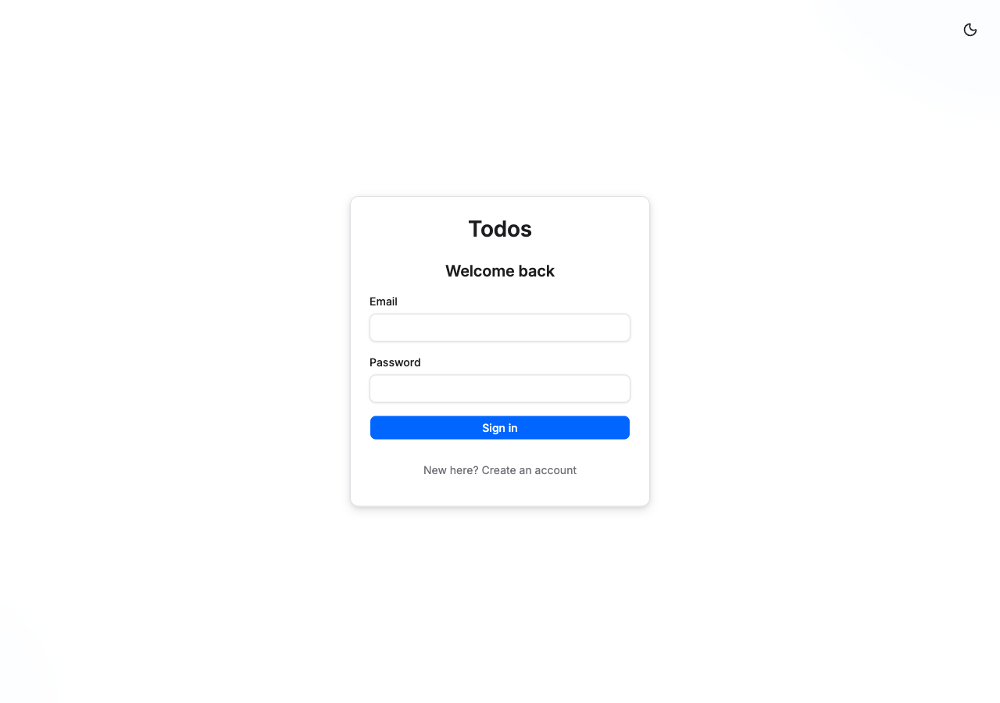
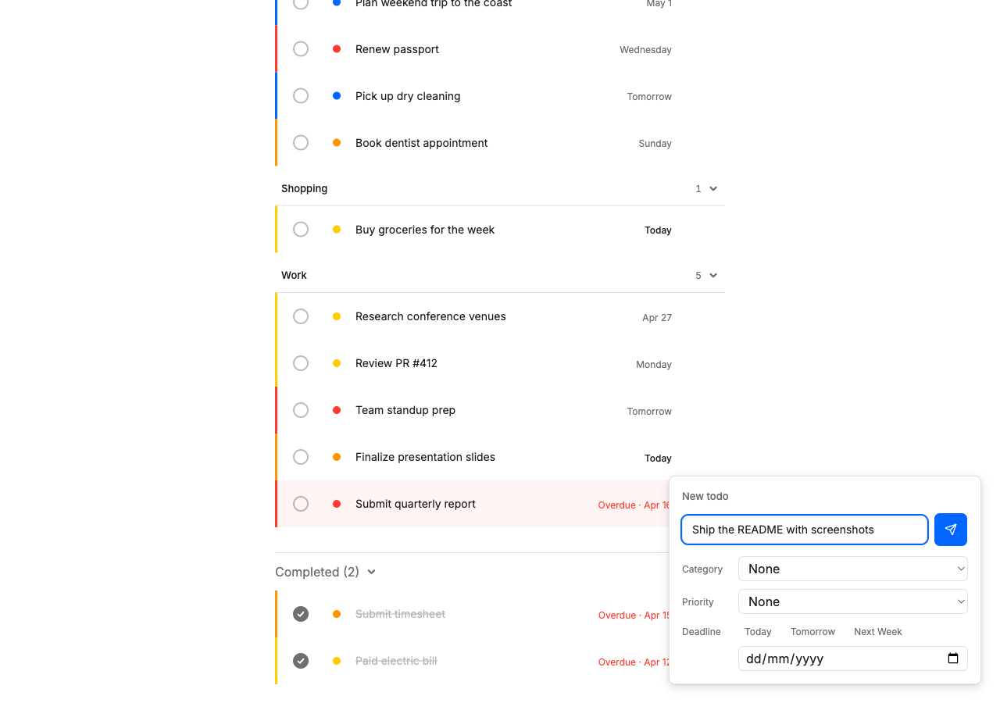
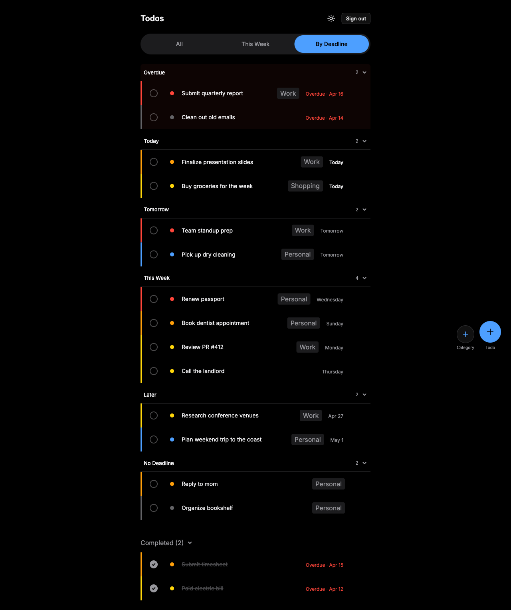
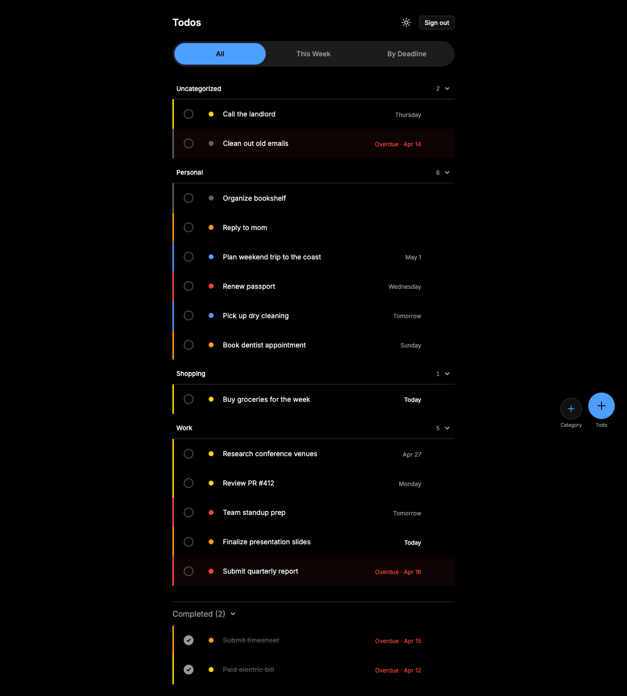

# bmad_nf_todo_app — Feature Overview

A minimal, crafted Todo web app — single-user, full-stack, containerized. This document walks through the features delivered across the seven completed epics, with representative screenshots.

For setup and run instructions, see the [top-level README](../README.md).

---

## Authentication

Email + password registration and login. Sessions are managed via httpOnly JWT cookies, and all todo routes require authentication. Logging out clears the session cookie and invalidates the in-memory auth state.

---

## The "All" view

The default view groups todos into collapsible category sections. Each todo row shows:

- A priority indicator (3px coloured left border, P1 red → P5 grey)
- A coloured priority dot matching the indicator
- The description
- A right-aligned deadline label (smart formatting: `Today`, `Tomorrow`, weekday name for this week, absolute date beyond)
- Delete / inline edit affordances

Overdue rows are tinted red. Completed todos drop into a collapsible section at the bottom (state persists in `localStorage`).

A floating action cluster in the bottom-right offers two buttons — `Category` and `Todo` — each opening a compact creation panel.

---

## The "Due This Week" view

A flat, priority-sorted list of active todos whose deadlines fall within the next 7 days. Category is shown as a chip between the description and the deadline (no section headers — the view is a single focused list). Sort: P1 first → P5 → no priority; ties broken by deadline ascending, then `createdAt`.

---

## The "By Deadline" view

Temporal grouping of all active todos: `Overdue` → `Today` → `Tomorrow` → `This Week` (days +2..+6) → `Later` → `No Deadline`. Each group header has a count badge and collapses independently. The `Overdue` group carries a subtle red tint. Empty groups are not rendered. Within each group, todos are sorted by priority then deadline.

---

## Creating a todo

The FAB opens an inline creation panel with three metadata selectors: category, priority, and deadline. Deadline offers quick-pick shortcuts (`Today` / `Tomorrow` / `Next Week`) alongside the native date input. Creation is optimistic — the todo appears immediately, rolling back cleanly if the server rejects it.

---

## Dark mode

A full design-token system drives both themes. Toggle persists across sessions. Priority colours and overdue tints remain readable against the dark background.

---

## Under the hood

- **Three views over one cache.** `All`, `This Week`, and `By Deadline` are all client-side lenses over a single `["todos"]` TanStack Query cache — no dedicated endpoints, zero network requests on view switches.
- **URL-driven view state.** `?view=all|week|deadline` — shareable links, browser back/forward works, deep links supported.
- **Optimistic mutations.** All writes (create, toggle, delete, inline edit) apply to the cache first and roll back on error.
- **Accessibility.** Segmented tab bar uses roving tabindex, section headers use `aria-expanded` with `aria-controls`, live region announces mutations.
- **Reduced motion respected.** Fade-on-view-switch collapses to ~0ms when `prefers-reduced-motion: reduce` is set.

For the full architectural reasoning, see [`_bmad-output/planning-artifacts/architecture.md`](../_bmad-output/planning-artifacts/architecture.md).
